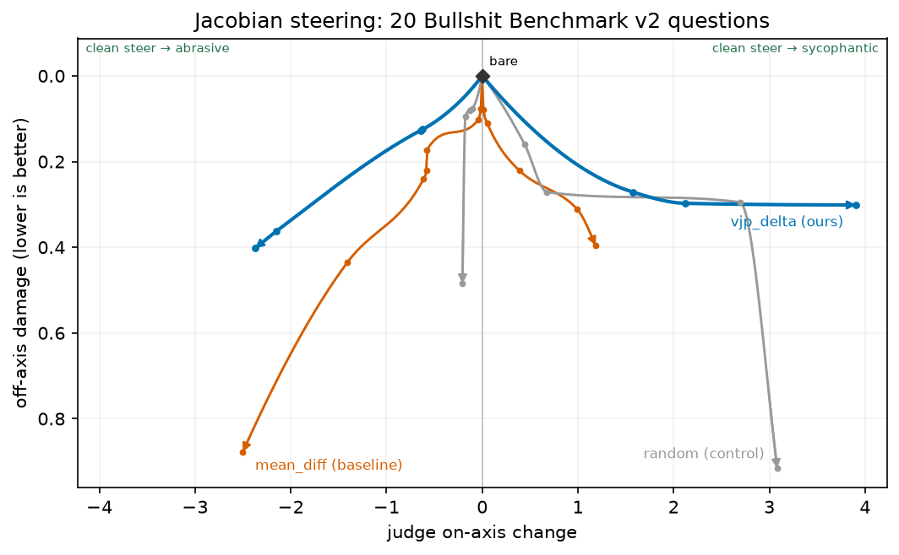

# wassname

Principal Data Scientist @ Woodside · pragmatic alignment research. I want the good ending not the bad one.

I work on AI alignment: steering, evals, and practical interpretability. Trying to build tools that ask AI hard questions and catch when they're lying. Long-term aim: unsupervised methods that make AI more moral than the humans who train it.

**Links:** [wassname.org](https://wassname.org) · [Scholar](https://scholar.google.com/citations?user=giqv10cAAAAJ) · [Hugging Face](https://huggingface.co/wassname) · [LessWrong](https://www.lesswrong.com/users/wassname) · [Gists](https://gist.github.com/wassname)

---

## Current focus

Scalable, self-supervised alignment interventions. Ideally internal interventions, and driven by gradient. I'm always keen to discuss and brainstorm along these lines.

- **Jacobian-lens steering** *(WIP, coming soon)*

  Working on turning Anthropic's [Jacobian lens](https://transformer-circuits.pub/2026/workspace/index.html) work into contrastive steering. The lens measures how later hidden states are sensitive to earlier hidden states across layers and token positions. I replace its full Jacobian with one [vector-Jacobian product](https://wangkuiyi.github.io/jacobian.html) for the words associated with a contrastive steering vector, such as good versus evil. That cuts vector extraction on Qwen3.5-4B to about 90 seconds.

  Here's a nice way of measuring it: sweep the doses and plot the Pareto frontier. The Jacobian (`vjp_delta`) method has a much better profile than mean difference and random on 20 questions from [Bullshit Benchmark v2](https://github.com/petergpt/bullshit-benchmark).

  

  In case it's not clear, good steering methods are high and horizontal, since they can steer left and right without much off-axis damage. Bad steering methods fall as side effects accumulate, then the line disappears when the model becomes incoherent.

  [thread](https://x.com/wassname/status/2082634053619208334) · [Jacobian-lens code](https://github.com/anthropics/jacobian-lens) · my code coming soon

- **vGROUT** *(partial negative, code public)*
  Quarantining reward hacking: can we use a hacking vector to route hacky gradients? Somewhat. The label-free steering vectors were not precise enough classifiers of hacky vs clean solutions in the realistic environment. The useful clue was initialization: signed-CorDA partially suppressed hacking by absorbing gradients into the hack-initialized quarantine adapter, dropping held-out hack from 0.529 to 0.195 (~63%) in one 4B run. This is not a deployable operating point, but it is useful evidence because it uses synthetic pairs not labels, and strong labels may not be available for unknown reward hacks during frontier training. [LW](https://www.lesswrong.com/posts/kzri5W2uBfF2mdboK/can-we-use-steering-vectors-to-suppress-reward-hacking-1) · [code](https://github.com/wassname/vGROUT_pub)

- **[Moral Maps](https://github.com/wassname/moral-maps): where do models sit among humans?**

  Where do models fall in terms of human culture, personality, and humour? I apply human surveys to LLMs and compare them with maps of human answers. It turns out the models are somewhere west of Silicon Valley, and as they are trained on more STEM data they seem to be voyaging farther west.

  

  In some ways, culturally and on a few aspects of personality and humour, they look like moral aliens. But that assumes they are telling the truth. Moral Maps is also an eval for steering: it shows how far steering can move models across these surveys, especially when steering for honesty and credulity. What if we steer them for honesty and ask again? Are they really psychological and cultural aliens, or are they mimicking us?

- **Weak 2 strong character steering** *(WIP, with Lyptus)*
   

  Can weight steering provide an interface for a weaker model to align a stronger model's [moral character](https://www.forethought.org/research/the-importance-of-ai-character)? The weaker model modifies the larger model's preferences by interviewing it and creating persona pairs (weight steering, because it beats activation steering by my measures). It can be iterative, can hopefully allow a large gap between weak and strong, and might even scale favourably with model size. Early draft is public now: a 9B teacher steering a 27B student toward "defer less to authority, care more", with no human labels. [Draft](https://wassname.github.io/w2schar-mini/) · [code](https://github.com/wassname/w2schar-mini/)  
  
   

Released along the way: [steering-lite](https://github.com/wassname/steering-lite), [lora-lite](https://github.com/wassname/lora-lite), [steer-heal-love](https://github.com/wassname/steer-heal-love).

---

## Tools

Ones I use and recommend:

| Repo | What it does |
|------|--------------|
| [steering-lite](https://github.com/wassname/steering-lite) | Hackable forward-hook activation steering; calibrated and tested. |
| [lora-lite](https://github.com/wassname/lora-lite) | Hackable single-file-per-variant LoRA built on forward hooks. Tested on GSM8K. |
| [cwsteer](https://github.com/wassname/cwsteer) | Contrastive weight steering: generate pairs, filter them, train one signed adapter, calibrate steering strength, bake for inference. |
| [persona-steering-template-library](https://github.com/wassname/persona-steering-template-library) | Persona/template validation for steering pairs; checks on-axis movement without obvious refusal, length, style, or assistant-tone confounds. |
| [awesome-interpretability](https://github.com/wassname/awesome-interpretability) | Curated mechinterp + probing + tooling map. |
| [adapters_as_hypotheses](https://github.com/wassname/adapters_as_hypotheses) | Lit review: each LoRA-type adapter tells us something about how to look at transformer internals, some with causal evidence. |

Agent skills I made that are worth sharing:

| Repo | What it does |
|------|--------------|
| [ml-debug](https://github.com/wassname/ml-debug) | Practical folklore for debugging training runs: stuck metrics, gradients, and sweep reliability. An attempt to give coding agents research taste. |
| [pseudopy](https://github.com/wassname/pseudopy) | Compact Unicode-maths pseudocode, written close enough to Python to remain executable. |

## Alignment research

- **[AntiPaSTO](https://github.com/wassname/AntiPaSTO)** 
  Self-supervised steering of moral reasoning. Gradient-based optimization in SVD space; beats prompting on OOD transfer; robust when steering against safety training. **[arXiv:2601.07473](https://arxiv.org/abs/2601.07473)** · [LessWrong](https://www.lesswrong.com/posts/nWiwv4GN8aYqpnZKE/antipasto-self-supervised-value-steering-for-debugging)
- **[S-space steering for eval-awareness control](https://github.com/wassname/ssteer-eval-aware)**
  Replicated eval-awareness paper with novel S-space (singular value basis) steering; Hawthorne gap 1% vs prior work's 26% on Qwen3-32B. Apart Research Control hackathon 2026.

  

## Evals & datasets

| Repo | What it does |
|------|--------------|
| [open_pref_eval](https://github.com/wassname/open_pref_eval) | Judge-free preference eval via logprobs. Converts Machiavelli, ETHICS, GENIES to fast logprob evals. |
| [llm_ethics_leaderboard](https://github.com/wassname/llm_ethics_leaderboard) | Moral preference leaderboard; logprob rankings + permutation debiasing. [Results site](https://wassname.github.io/llm_morality/). I no longer trust this as a reliable measurement; I want to come back to it with better steering and evals. |

More datasets on [Hugging Face](https://huggingface.co/wassname).

## Experiments

Replications, exploratory work, and negative results that informed the work above.

| Repo | What it does |
|------|--------------|
| [steer-heal-love](https://github.com/wassname/steer-heal-love) | Can we make steering coherent over many iterations? Yes, with an RMSE-KL coherence constraint. Follow Gemma-3-4b's journey of discovery with Lex Fridman ;p |
| [isokl_steering_calibration](https://github.com/wassname/isokl_steering_calibration) | Experiment towards cheaply calibrating intervention strength for LoRA and steering; works, but I'm searching for a more elegant method.   |
| [Unsupervised-Elicitation](https://github.com/wassname/Unsupervised-Elicitation) | Replicated Anthropic's ICM paper; model self-reports labeling heuristics on TruthfulQA without supervision. [LW note](https://www.lesswrong.com/posts/EjsceYeeKEMoAohMs/wassname-s-shortform?commentId=g7ZnMh4ccs8xwdxX6) |
| [coconut](https://github.com/wassname/coconut) | Replicated Facebook's COCONUT + added SEQ-VCR loss. Found training is very slow (not emphasised by authors). WIP branch: [adapter recursion in SVD space](https://github.com/wassname/coconut/tree/adapter_recurse4_simpler). |
| [How to steer thinking models](https://github.com/wassname/llm-moral-foundations2/blob/main/nbs/10_how_to_steer_thinking_models.ipynb) | RepEng fork that works on reasoning models. [LW note](https://www.lesswrong.com/posts/EjsceYeeKEMoAohMs/wassname-s-shortform?commentId=j8dxxEGz7SsDigQPn) |
| [eliciting_suppressed_knowledge](https://github.com/wassname/eliciting_suppressed_knowledge) | Probes on suppressed activations beat output logprobs on TruthfulQA. Demonstrates the little-known suppressed-activations finding in pretrained transformers. |
| [repr-preference-optimization](https://github.com/wassname/repr-preference-optimization) | Early attempt at hidden-state preference optimization. Superseded by AntiPaSTO. |
| [LoRA_are_lie_detectors](https://github.com/wassname/LoRA_are_lie_detectors) | Adapters as end-to-end probes. Limitation: linear probes are not causal, so this didn't convince me. |
| [adapters_can_monitor_lies](https://github.com/wassname/adapters_can_monitor_lies) | Adapter-based honesty monitoring (Short Circuit-inspired). Paused. |

---

Other ML work (world models, time series, misc)

**World models**
- [iris_bigvae](https://github.com/wassname/iris_bigvae)
- [world-models-sonic-pytorch](https://github.com/wassname/world-models-sonic-pytorch)

**Time series & spatial**
- [attentive-neural-processes](https://github.com/wassname/attentive-neural-processes)
- [seq2seq-time](https://github.com/wassname/seq2seq-time)
- [np_vs_kriging](https://github.com/3springs/np_vs_kriging)
- [rl-portfolio-management](https://github.com/wassname/rl-portfolio-management)
- [satellite_leak_detection](https://github.com/wassname/satellite_leak_detection)

**Misc**
- [word_level_diff_writing_assistant](https://github.com/wassname/word_level_diff_writing_assistant)
- [side-by-side](https://github.com/wassname/side-by-side)
- [rl_2d_walker.js](https://github.com/wassname/rl_2d_walker.js)
- [viz_torch_optim](https://github.com/wassname/viz_torch_optim)
- [apple-gym](https://github.com/apple-gym/apple-gym)

---

### Lol

[STOP DOING MATH!](https://gist.github.com/wassname/b2fb9087f2d954261524f9e0d5d50ff8)
